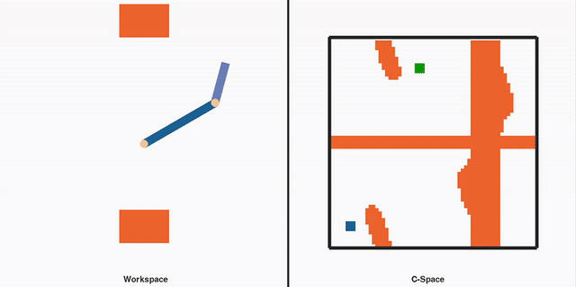
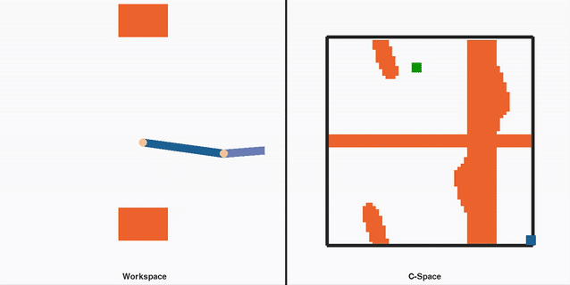
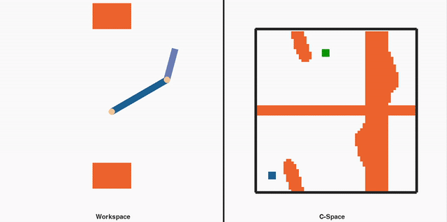
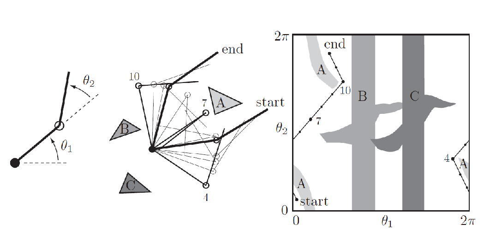
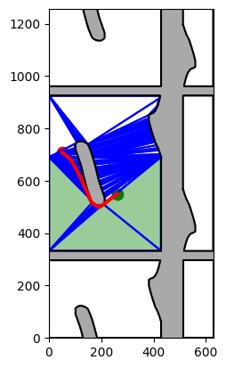
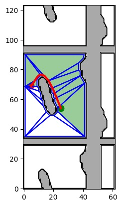

# Robotic-Manipulator-Configuration-Space-Simulation 
A pygame based interactive simulation for a 2D planar robotic manipulator with joint contraints and obstacles. It computes and displays the workspace and configuration space of the robot, side by side, in real-time. You can simulate the motion of the manipulator in the workspace and the configuration space by using key presses to change the current robot configuration and obstacle positions. Joint angle constraints can be changed to visualize the impact on the free configuration space of the robot. The simulation can also be used to compute and display trajectories between robot start and goal poses by using motion planning algorithms that use an occupancy grid.

## Simulation Controls:
### Press W/A/S/D: Move robot in workspace and configuration space by changing joint angles. 
- Simulates collision with obstacle by changing colour of link 

### Press 8/5/4/6: Move the Top obstacle

### Press G: Simulate a pre-computed motion plan from the current pose to goal Pose. 
- Current pose is shown by the blue rectangle in C-space
- Goal Pose is shown by the green rectangle in C-space

### Change to Setup
- Change the global variables to modify the obstacle sizes, joint angle constraints, robot link dimension and more

## Methods
### Introduction
- The workspace of a robot is the actual physical space in which it exists. Since a robotic manipulator is not a simple point in space, it is very difficult to plan trajectories and paths around obstacles and other constraints in the workspace. A robot can also be described by it's configuration --- a description of the location of the robot in terms of its degrees of freedom. For a 2D planar robotic manipulator, the configuration space consists of all the possible joint angles for the joint 1 and 2 of the robot. The current configuration, that is the current joint angle vector of the robot, is a point in this high dimensional space. The following figure from [1] illustrates this mapping from workspace to configuration space:

### Computing Configuration Space
We use a simple algorithm to find the configuration space of the robot. We search through the space of all the joint angle vectors (configurations) of the robot. 
- if the given configuration of the robot, it collides with an obstacle or voilates joint constraints, then that configuration is marked as occupied (orange colour) in the configuration space. 
- If no such collision or voilation occurs than that configuration is marked as free (white colour)

Every time an obstacle changes position, configuration space is calculated again and then visualized.

### Forward kinematics
For a given configuration (joint angle vector), we use the forward kinematics transformation for the given 2D manipulator to find the cartesian X and Y coordinates of the robot in 2D space and then draw them on screen

### Collision Checking
The two links of the robot and the two obstacles are represented by shapely polygon objects. Collision of links with obstacles is determined by checking the interection of these polygons with each other. We use shapely for this purpose which has fast and robust algorithms for checking polygon interections.

### Motion Planning
The configuration space is computed as a standard occupancy grid where every joint angle pair corresponds with either 1 to represent occupied space and or 0 to represent free space. Motion planning algorithms can be used to find a path between any starting pose and goal pose of the robotic manipulator. We can use the configuration space where the poses are simply points and we simply need to find a path connecting those points while avoiding constraints and obstacles. Such approaches must, however, account for the warped nature of the configuration space (0 degree joint angle is the same as 2pi joint angle)

### Pre-Computed Motion plan
We computed an example path between a starting and end pose by using the navigation with polytopes tool box [2]. Currently it is not integrated with this repository. Here are two sample paths computed for different occupancy grid resolutions visualized: 

 

## Environment
- Set up a Python 3.12 environment. Python 3.12 [Miniconda Distribution](https://www.anaconda.com/download)
- Install the required packages by using pip and the provided requirements.txt file
- Run main.py to start the simulation in a Pygame window

## Additional Sources
This tool is inspired by the following two simulations
- [University of North Carolina's configuration space visualization of a 2-D robotic manipulator](https://robotics.cs.unc.edu/C-space/index.html)
- [La Jones 2D Planar robot Configuration Space Simulation in Javascript](https://archive.lajones21.com/configurationspace.html)

## References
1.  Modern Robotics: Mechanics, Planning, and Control (Kevin Lynch and Frank Park, Cambridge University Press 2017)

1. @Article{s23073532,
AUTHOR = {Nguyen, Ngoc Thinh and Gangavarapu, Pranav Tej and Kompe, Niklas Fin and Schildbach, Georg and Ernst, Floris},
TITLE = {Navigation with Polytopes: A Toolbox for Optimal Path Planning with Polytope Maps and B-spline Curves},
JOURNAL = {Sensors},
VOLUME = {23},
YEAR = {2023},
NUMBER = {7},
ARTICLE-NUMBER = {3532},
URL = {https://www.mdpi.com/1424-8220/23/7/3532},
PubMedID = {37050593},
ISSN = {1424-8220},
DOI = {10.3390/s23073532}
}
